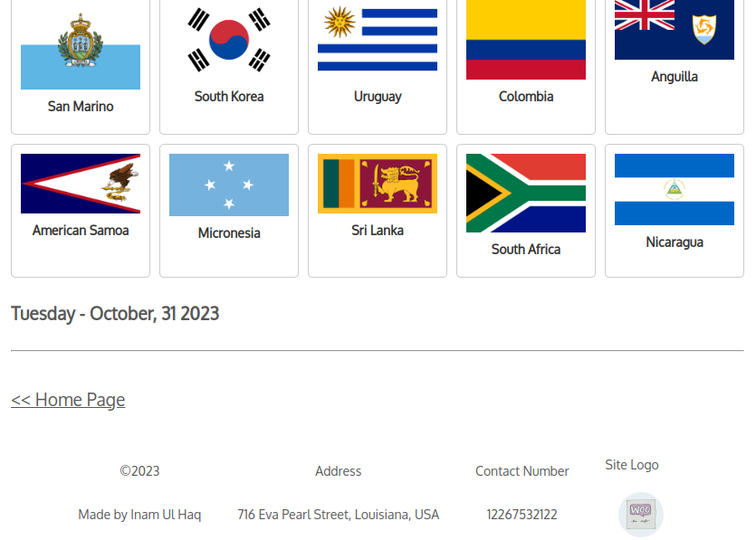

Global Flags Theme & FAQs Shortcode Plugin
====

  

### Usage

1) Create a FAQ post from custom post type. 
2) Shortcode will be displayed in the posts table.
3) Use shortcode on any page to dispaly FAQs.

Shortcode to display countries names & flag is [display_countries].
ACF field name must be 'gft_countries'.
1) Create ACF field with name 'gft_countries'
2) Add desired page to location rule. 
3) Edit the page to update setting and shortcode will be rendered.

Field names:
1) Site Logo: 'gft_site_logo'
2) Address: 'gft_address'
3) Contact Number: 'gft_contact'
4) Follow same procedure as countrie field.

